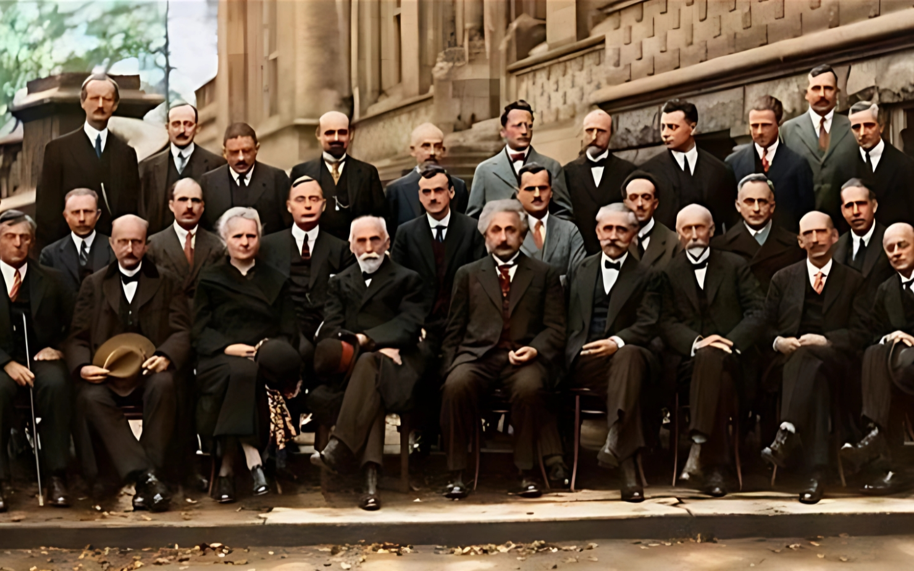
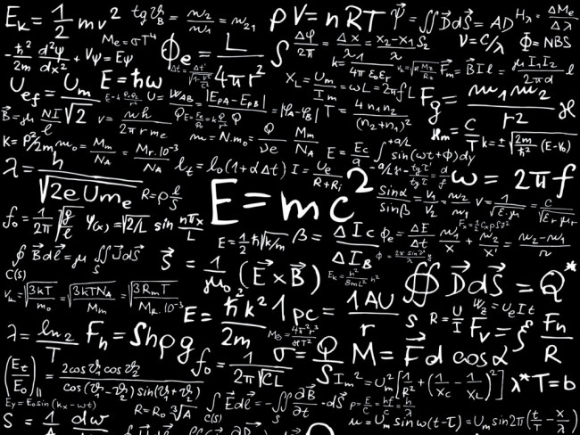
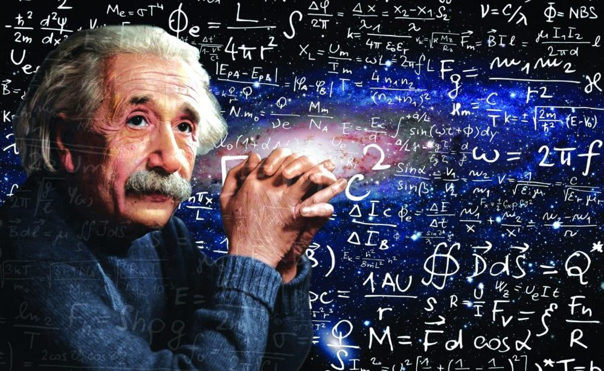
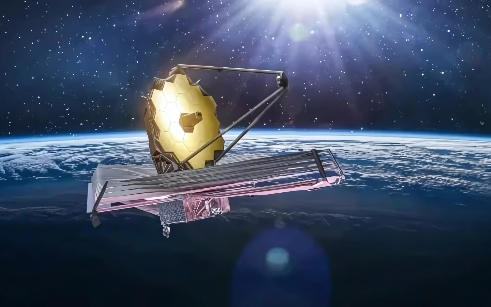
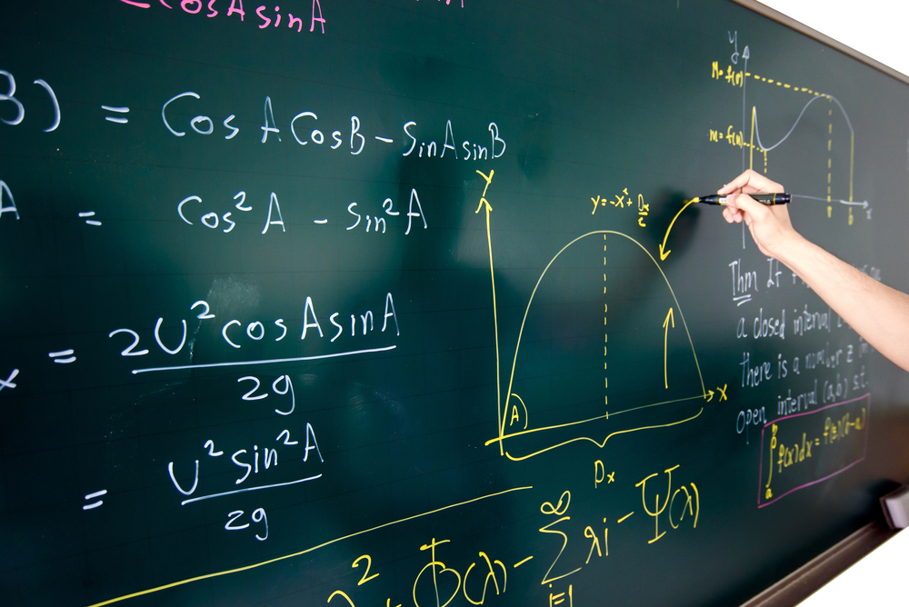

INTRODUÇÃO À FÍSICA
Neste capítulo introdutório, vou apresentar o que é a física, suas principais divisões, suas origens filosóficas e como ela se relaciona com a matemática.
easy
0

::: center
{width="100%"}
:::

Olá, meu nome é spoopy, e sou um grande entusiasta em física e exatas.
Nesse primeiro capitulo da seção de **Física** eu irei fazer uma breve
introdução à física.

Nessa Itrodução, eu irei abordar alguns assuntos como:

- O que é **física**?

- Como se divide a **física**

- Origens filosóficas

- A relação entre **Física** e **Matemática**

# O que é física?

A física é a ciência que estuda os fenômenos naturais de todo o
universo, tudo aquilo que pode ser observado, medido e descrito em
termos de leis e modelos matemáticos.

Seu objetivo principal é entender como e por que as coisas acontecem,
desde os movimentos de planetas, até o comportamento de partículas
subatômicas, passando pela luz, o som, a eletricidade, o tempo e até o
próprio espaço.

::: center
{width="100%"}
:::

**Em termos simples:**

> Física é o estudo das leis da natureza que explicam como o universo funciona.

**Curiosidade:**

> O nome "Física" vem do grego *physis*, que significa "natureza".

# Como se divide a **física**

A física pode ser dividida em três grandes áreas:

::: center
{width="100%"}
:::

- **Física Clássica:** estuda os fenômenos em escalas do cotidiano, como
  o movimento, a força, a energia, o som e a luz, usando as leis de
  Newton, a termodinâmica e o eletromagnetismo.

  ::: center
  {width="100%"}
  :::

- **Física Moderna:** aborda fenômenos em escalas muito pequenas (átomos
  e partículas) ou muito rápidas e energéticas. Inclui a relatividade, a
  mecânica quântica, a física nuclear e de partículas.

  ::: center
  {width="100%"}
  :::

- **Físicas Interdisciplinares:** misturam a física com outras áreas,
  como:

  - *Astrofísica e Cosmologia* (universo e estrelas),

  - *Biofísica* (fenômenos em seres vivos),

  - *Física Médica* (imagens e tratamentos),

  - *Geofísica* (estrutura da Terra),

  - *Física Computacional* (simulações com computadores),

  - *Física do Solo*, entre outras.

Essas divisões ajudam a organizar o conhecimento, mas muitas vezes se
sobrepõem, já que a física está presente em tudo ao nosso redor.

# Origens filosóficas

A física nasceu da filosofia. Na Grécia Antiga, pensadores como **Tales
de Mileto**, **Pitágoras**, **Platão** e **Aristóteles** tentavam
entender a natureza usando a razão, sem depender de mitos.

Esses filósofos buscavam responder perguntas como:

- Do que tudo é feito?

- Por que as coisas se movem?

- Existe uma ordem na natureza?

Com o tempo, essa busca por entender o mundo evoluiu para uma ciência
baseada em observação, experimentação e matemática.

**Exemplo:** Aristóteles acreditava que objetos caíam mais rápido se
fossem mais pesados. Séculos depois, **Galileu Galilei** provou com
experimentos que isso não é verdade --- um marco na transição da
filosofia para a física moderna.

::: center
{width="100%"}
:::

A física, portanto, tem raízes filosóficas profundas, mas se tornou uma
ciência independente quando passou a se basear em testes e medidas.

# A relação entre **Física** e **Matemática**

A **física** e a **matemática** estão profundamente conectadas. A física
busca entender como o universo funciona, enquanto a matemática fornece a
linguagem para descrever e prever esses fenômenos com precisão.

## Por que a física usa matemática? 

A natureza segue padrões e leis. A matemática permite:

- **Expressar leis físicas de forma exata** --- como $F = m a$ (Segunda
  Lei de Newton).

- **Fazer previsões** --- como calcular a trajetória de um foguete.

- **Analisar fenômenos complexos** --- como ondas, circuitos elétricos
  ou o comportamento de átomos.

## Exemplo prático 

Imagine estudar o movimento de um carro. A física observa o movimento; a
matemática permite calcular a velocidade, a aceleração e o tempo para
parar. Sem matemática, seria impossível prever com segurança esses
comportamentos.

::: center
{width="100%"}
:::

## Matemática como ferramenta da física

- **Álgebra e trigonometria**, fundamentais para resolver problemas
  de mecânica e óptica.

- **Cálculo diferencial e integral**, usados para estudar movimento,
  variações de energia e campos.

- **Equações diferenciais** --- modelam sistemas como o pêndulo,
  circuitos elétricos ou a propagação de ondas.

- **Geometria e vetores** --- importantes para representar forças,
  deslocamentos e campos físicos.

- **Estatística e probabilidade** --- usadas em física quântica,
  termodinâmica e física de partículas.

## Resumo 

A matemática não apenas ajuda a descrever fenômenos físicos --- ela é
essencial para a própria existência da física como ciência. Sem
matemática, a física seria apenas uma observação sem previsão.

## Curiosidade 

O físico **Galileu Galilei** dizia:

> *"A matemática é o alfabeto com o qual Deus escreveu o universo."*
