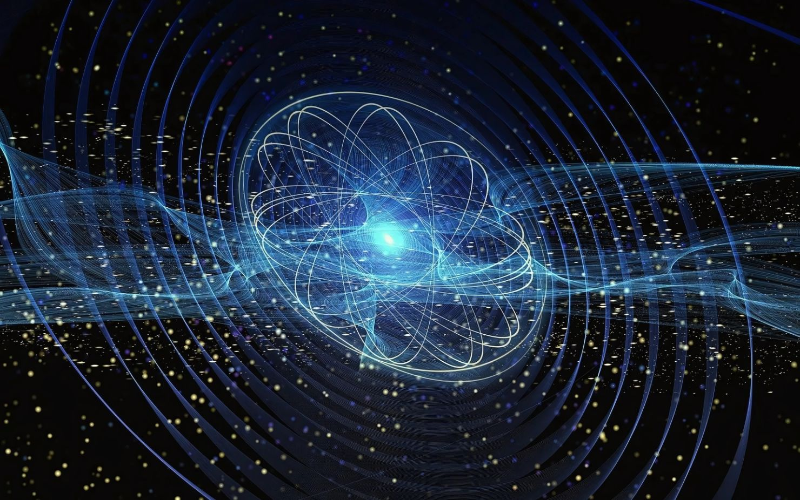
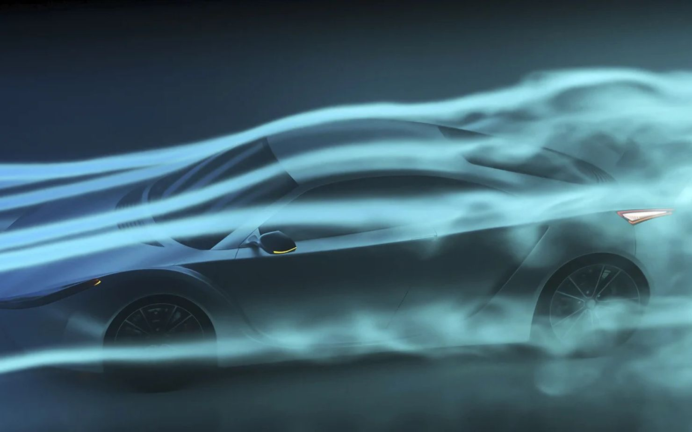
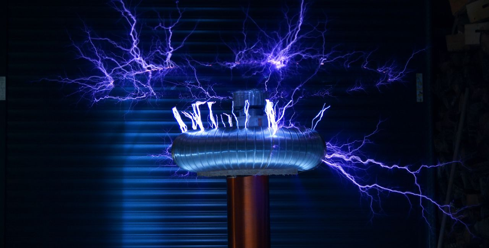
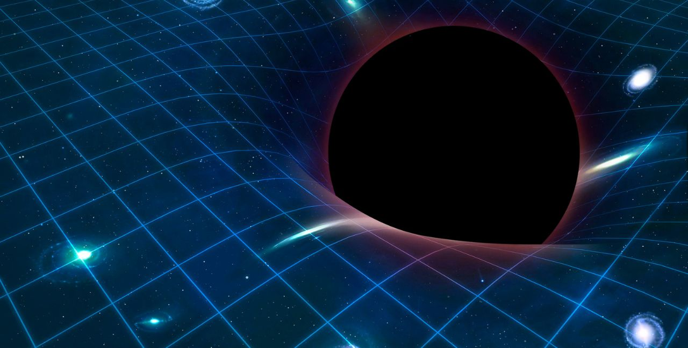
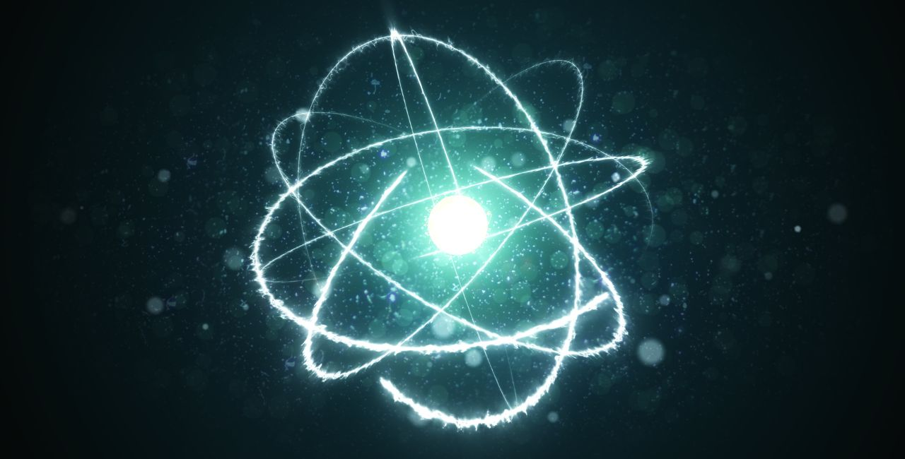

As principais áreas da física
Neste capítulo, vou apresentar o que é a física, suas origens, como ela se divide, e depois explorar suas principais áreas: da Física Clássica à Moderna, passando também pelas Físicas Interdisciplinares.
easy
1

::: center
{width="100%"}
:::

A física é dividida em várias áreas de estudo, cada uma responsável por
investigar diferentes aspectos da natureza. Vou dividir em Física
Clássica *x* Física Moderna *e* Físicas Interdisciplinares,
A **física Clássica** é toda a física desenvolvida antes do século XX,
ela descreve muito bem o mundo cotidiano.
A **física Moderna** é a física que surgiu do século XX em diante, para
explicar o que a física clássica nao conseguia, coisas MUITO grandes e
MUITO pequenas
As **físicas Interdisciplinares** São áreas da física que se misturam
com outras ciências para resolver problemas complexos ou aplicar a
física em outros contextos.

## Física Clássica

### Mecânica

A Mecânica é o estudo do movimento dos corpos, a força que os causam e
os princípios de equilíbrio. Divide-se em:

::: center
{width="100%"}
:::

#### Cinemática

Estuda o movimento dos corpos sem considerar suas causas. Analisa
grandezas como: *posição*, *velocidade* e *aceleração*, utilizando
equações matemáticas para descrever trajetórias. 
É fundamental para engenharia de transportes, como no cálculo da
trajetória de foguetes. 
(ex: movimento parabólico de projéteis ou a queda livre de objetos)

::: center
{width="100%"}
:::

#### Dinâmica

Investiga as forças que causam ou modificam o movimento, baseando-se nas
leis de Newton. Explica fenômenos como a inércia, a relação entre força
e aceleração e a lei da ação e reação. Aplica-se desde o funcionamento
de motores até a análise de múltiplas colisões. 
(ex: Peritos físicos analisam o  "nível " de amasso do carro para
calcular a que velocidade o carro que bateu estava)

::: center
{width="100%"}
:::

#### Estática

Dedica-se ao equilíbrio de corpos rígidos, onde forças e torques se
cancelam. Essencial na construção civil, garantindo que não haja
movimento indesejado. 
(ex: criação de pontes e edifícios)

::: center
{width="100%"}
:::

#### Mecânica dos Fluidos

Examina o comportamento de líquidos e gases em repouso(hidrostática) e
em movimento(hidrodinâmica). Conceitos como pressão, viscosidade e
empuxo são cruciais para projetos de submarinos, sistema de irrigação e
aerodinâmica de aviões 
(ex: efeito Bernoulli)

::: center
{width="100%"}
:::

### Termodinâmica

Estuda a relação entre calor, trabalho, temperatura e energia. Suas
quatro leis explicam, como acontece a conversão de calor em energia
mecânica ($1^{a}$ lei) e o porque alguns processos naturais só acontecem de um
jeito e não dá para voltar atrás ($2^{a}$ lei, entropia). Também explica
mudanças de fase (fusão, vaporização). 
(ex: criação/estudo de motores térmicos)

::: center
{width="100%"}
:::

### Óptica

Estuda a luz e suas interações com a matéria. Divide-se em:

#### Geométrica

Analisa a luz como raios que seguem trajetórias retilíneas, explicando
fenômenos como reflexão em espelhos e refração em lentes. 
(ex: instrumentos como microscópios e telescópios)

#### Óptica Ondulatória

Mostra que a luz se comporta como uma onda, criando efeitos como anéis
coloridos, padrões ao passar por fendas e luz filtrada. Isso é usado em
hologramas e óculos com filtro de luz. 
(ex: quando você olha para uma bolha de sabão e vê aquelas cores
brilhantes e variadas, interferência)
introduction

::: center
{width="100%"}
:::

### Eletromagnetismo

Estuda fenômenos relacionados à eletricidade e ao magnetismo, mostrando
que oss dois estão ligados, Dividi-se em:

#### Eletrostática

Estuda cargas elétricas em repouso, descrevendo campos elétricos,
potencial eletrostático e a força entre as cargas (Lei de Coulomb).
Aplica-se a isolantes, capacitores e etc. 
(ex: estudo de descargas atmosféricas como raios)

#### Circuitos

Foca na corrente elétrica, explorando resistência, leis de Ohm e
Kirchoff. Essencial para o funcionamento de dispositivos eletrônicos e
redes de energia. 
(ex: Dentro de qualquer computador)

#### Magnetostática

A magnetostática é a parte do eletromagnetismo que estuda os campos
magnéticos gerados por correntes elétricas constantes (que não mudam com
o tempo). 
(ex: no alto falante á um imã)

#### Eletrodinâmica

A eletrodinâmica estuda como os campos elétricos e magnéticos mudam com
o tempo e como eles se influenciam mutuamente.Essa troca constante é o
que forma as ondas eletromagnéticas. 
(ex: ondas de rádio, micro-ondas, wifi, 4G, etc ...)

::: center
{width="100%"}
:::

### Ondulatória

Estuda as propriedades das ondas, sejam mecânicas (som, ondas em cordas)
ou eletromagnéticas (luz, rádio). Abrange conceitos como frequência,
comprimento de onda, ressonância e superposição. 
(ex: análise de terremotos, ondas sísmicas)

::: center
.jpg){width="100%"}
:::

### Acústica

Especializada em ondas sonoras, investiga propriedades como intensidade
(decibéis), frequência (tons graves/agudos) e timbre.Aplica-se ao
projeto de instrumentos musicais, isolamento acústico em construções e
tecnologias médicas (ultrassom). 
(ex: Nos radares metereológicos é utilizado o efeito doppler)

## Física Moderna

::: center
{width="100%"}
:::

### Relatividade Restrita

Desenvolvida por Einstein em 1905, descreve objetos em movimento próximo
à velocidade da luz. Introduz conceitos como dilatação temporal e
contração espacial. 
(ex: aceleradores de partículas, aceleram as partículas para entender
como o tempo é dilatado)

### Relatividade Geral

Explica a gravidade como curvatura do espaço-tempo, prevendo buracos
negros, ondas gravitacionais (detectadas em 2015) e a expansão do
universo. 
(ex: A Engenharia Aerospacial utiliza satélites de GPS que estão
sujeitos a efeitos gravitacionais que alteram a passagem do tempo, e com
a relatividade Geral faz com que funcione com precisão)

::: center
{width="100%"}
:::

### Física Quântica

Mudou muito o jeito de entender o mundo das coisas muito pequenas,
mostrando que partículas podem estar em vários lugares ou estados ao
mesmo tempo (superposição) e que elas podem ficar conectadas de um jeito
especial, mesmo estando longe uma da outra (entrelaçamento quântico). 
(ex: Dentro do LED, acontece um fenômeno chamado emissão
eletroluminescente, que só pode ser explicado pela física quântica)

::: center
{width="100%"}
:::

### Física Nuclear

Investiga o núcleo atômico, suas forças (nuclear forte) e processos como
fissão (quebra de núcleos pesados, usada em reatores) e fusão (união de
núcleos leves, como no Sol). 
(ex: Radioterapia é um tratamento médico que usa radiação ionizante para
destruir células cancerígenas)

### Física de Partículas

Ela estuda as menores partículas que formam tudo no universo, como
quarks, elétrons e neutrinos, e as forças que fazem essas partículas
interagirem --- tipo eletricidade e forças dentro do átomo. Um modelo
chamado Modelo Padrão explica como essas partículas e forças funcionam,
mas ainda há mistérios, como a matéria escura, que ninguém sabe direito
o que é. Para entender melhor, cientistas usam máquinas gigantes como o
LHC (Grande Colisor de Hádrons) no CERN, que bate partículas muito
rápido para criar condições parecidas com o início do universo (Big
Bang) e testar essas ideias. 
(ex: Pesquisas em física de partículas ajudam a entender melhor a
estrutura da matéria em nível fundamental. Isso impulsiona o
desenvolvimento de materiais supercondutores e nanomateriais usados em
eletrônica, energia e transportes.)

## Fisícas Interdisciplinares

::: center
{width="100%"}
:::

### astrofísica

Estuda o espaço e os corpos celestes, como estrelas, galáxias e buracos
negros. Usa telescópios e dados de sondas espaciais (como o Hubble) para
entender como esses objetos se formam, funcionam e evoluem.

### Cosmologia

É a parte da física que tenta entender o universo inteiro --- como ele
começou (Big Bang), como está estruturado e o que pode acontecer no
futuro. Também estuda mistérios como a matéria escura e a energia
escura, que formam a maior parte do universo, mas ainda são pouco
compreendidas.

### Biofísica

Mistura física com biologia para entender como funcionam os seres vivos.
Por exemplo: como moléculas se movem dentro das células, como os
músculos se contraem ou como os neurônios transmitem sinais elétricos.

### Física Médica

Aplica a física na medicina. Desenvolve equipamentos como raios-X,
tomografia e radioterapia. Também estuda a quantidade segura de radiação
para evitar danos ao corpo.

### Física Computacional

Usa computadores potentes para simular coisas muito complexas, como o
clima da Terra, colisões entre galáxias ou testes com novos materiais.
Isso ajuda na pesquisa de energia, saúde e até pandemias.

### Física estatística

Estuda sistemas com muitas partículas (como gases ou metais) usando
probabilidade. Explica fenômenos como mudanças de estado (ex: gelo
virando vapor) e como os átomos se organizam para formar ímãs.

### Geofísica

Usa a física para entender o planeta Terra: terremotos, vulcões, campo
magnético, e o que existe no interior do planeta. É útil em estudos
ambientais e na busca por petróleo ou minerais.

### Física do estado sólido

Estuda os materiais usados na tecnologia, como semicondutores (chips de
computador), supercondutores (transporte de eletricidade sem perdas) e
LEDs (luz eficiente). É a base da eletrônica moderna.

### Física da matéria condensada

Vai além dos estados comuns da matéria (sólido, líquido, gás). Estuda
materiais especiais, como grafeno (ultrafino e resistente), superfluidos
e cristais líquidos (usados em telas de TV e celular).

### Física do solo

Analisa como água, ar, calor e forças atuam no solo. Ajuda a entender o
funcionamento do solo em plantações, no meio ambiente e em construções.
Mistura física com geologia e agricultura.
